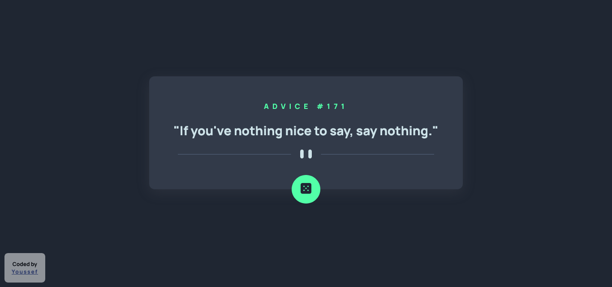

# Welcome! 👋

## Frontend Mentor - Advice generator app solution

This is a solution to the [Advice generator app challenge on Frontend Mentor](https://www.frontendmentor.io/challenges/advice-generator-app-QdUG-13db). 

## Table of contents

- [Overview](#overview)
  - [The challenge](#the-challenge)
  - [Screenshot](#screenshot)
  - [Links](#links)
- [My process](#my-process)
  - [Built with](#built-with)
  - [What I learned](#what-i-learned)
  - [Useful resources](#useful-resources)
- [Author](#author)

## Overview

### The challenge

Users should be able to:

- View the optimal layout depending on their device's screen size
- See hover states for interactive elements.

### Screenshot



Add a screenshot of your solution. The easiest way to do this is to use Firefox to view your project, right-click the page and select "Take a Screenshot". You can choose either a full-height screenshot or a cropped one based on how long the page is. If it's very long, it might be best to crop it.

Alternatively, you can use a tool like [FireShot](https://getfireshot.com/) to take the screenshot. FireShot has a free option, so you don't need to purchase it. 

Then crop/optimize/edit your image however you like, add it to your project, and update the file path in the image above.

### Links

- [Live site](https://your-live-site-url.com)

## My process

### Built with

- Semantic HTML5 markup
- CSS custom properties
- Flexbox
- CSS Grid
- Mobile-first workflow
- [Google Fonts](https://fonts.google.com/) - Google Fonts is a free and open source font library.
- [Advice API](https://api.adviceslip.com/) - Free API.

### What I learned

```html
I got shocked when i know that: 
  <picture>
    <source media="(min-width: 768px)" srcset="/path-of-photo" type="Optional">
    
  </picture>
```

```css
 .css {
   Just Improved my knowledge of layout;
 }
```

```js
  Using async() function
```

### Useful resources

- [Advice API](https://api.adviceslip.com/) - Where you can get the Advices.

- [API on MDN](https://api.adviceslip.com/) - Where you can learn about APIs.

## Author

- Website - **COMING SOON**
- [Linkedin](https://www.linkedin.com/in/joe-hsn/) - [Telegram](https://t.me/Joe_Hsn) - [Twitter](https://www.twitter.com/Jo_Hsn) - [Frontend Mentor](https://www.frontendmentor.io/profile/Joe-Hsn)

- Thanks for checking this out
